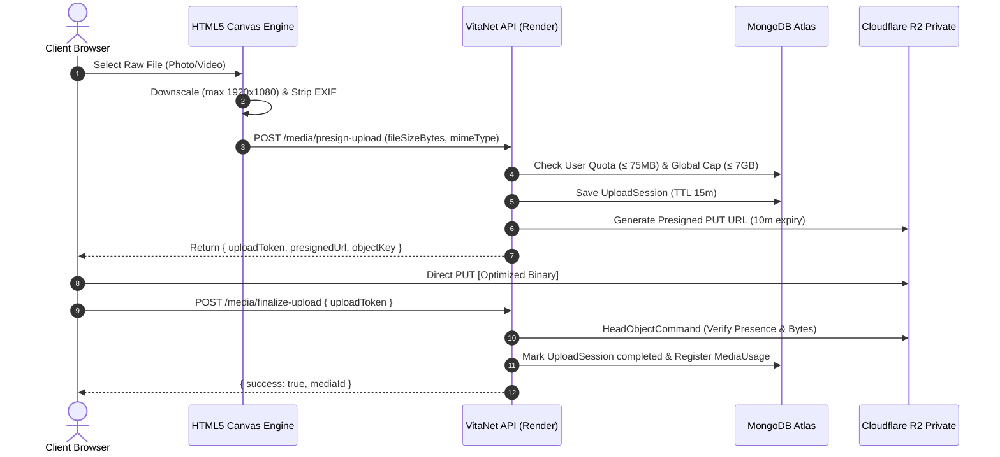

# VitaNet — Media Pipeline & Storage Architecture

VitaNet guarantees zero-cost media operations by offloading all image processing to the client's browser and isolating file transfers between the browser and Cloudflare R2.

---

## 1. Zero-Cost Pipeline Lifecycle

---

## 2. In-Browser Image Optimization & Privacy

Before requesting an upload slot, the client invokes `processImageOnCanvas()` in `client/src/hooks/useMediaUpload.js`:
1. The image is drawn into an offscreen HTML5 `<canvas>` element.
2. If either dimension exceeds 1920px (width) or 1080px (height), it is proportionally scaled down.
3. Canvas rendering strips all EXIF metadata tags, including GPS coordinates, camera model serial numbers, and capture timestamps.
4. The canvas exports a compressed JPEG or WebP blob with a quality factor of `0.85`, reducing multi-megabyte camera raw captures down to ~150–400 KB while preserving retina visual clarity.

---

## 3. Private Access & Presigned GET Downloads

- Public access (`r2.dev`) is disabled on the R2 bucket.
- To display images or stream videos, the backend issues signed GET URLs with a 15-minute expiry (`PRESIGNED_GET_EXPIRY_SECONDS = 900`).
- Feed endpoints (`/feed/following`, `/feed/explore`, `/posts/:id`) automatically batch-sign download URLs on the fly before returning payloads to the client.

---

## 4. Automated Orphan Media Cleanup

If a creator initiates an upload but closes their browser before calling `/media/finalize-upload`, an orphaned file could persist in R2.

The background reconciler (`server/src/jobs/orphanCleanup.js` and daily cron `.github/workflows/orphan-media-cleanup.yml`) resolves this:
1. Queries `UploadSession` records expired beyond 15 minutes.
2. Queries `MediaUsage` documents with `status: 'pending_delete'`.
3. Issues AWS S3 `DeleteObjectCommand` requests to Cloudflare R2.
4. Reconciles database ledgers, restoring unused storage quota to the user.
